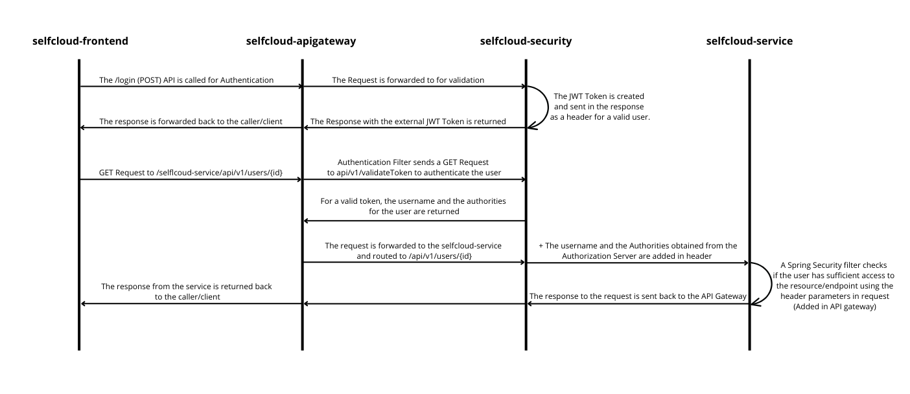

# selfcloud-security

Manages authentication and authorization, ensuring secure access to the 
platform. It handles user logins, token generation, and permissions

### Schema of authentication flow

The JWT is used for authentication and authorization in the Selfcloud environment.
The schema below illustrates the methods of operation.



## Privileges

Privileges have two levels:
* [ROLE](selfcloud-security-domain/src/main/java/pl/selfcloud/security/domain/model/privilege/Role.java) - for example `ROLE_USER`, `ROLE_ADMIN`
* [AUTHORITY](selfcloud-security-domain/src/main/java/pl/selfcloud/security/domain/model/privilege/Authority.java) - for example `READ_ORDER`, `CREATE_ORDER`

`ROLE` contains multiple `AUTHORITIES`. The endpoint of selflcoud services 
can be protected by either  a `ROLE` or an `AUTHORITY`.

## Security configuration

Security configuration is set in 
[SecurityConfig](selfcloud-security-infrastructure/src/main/java/pl/selfcloud/security/infrastructure/config/SecurityConfig.java)
class. The _selfcloud-security_ provides:

* a stateless session using JWT token,

* the ability to authenticate using
either personal credentials  (email and password)
or a Google account,

* authentication and authorization services using a custom filter.

```java
 public SecurityFilterChain filterChain(final HttpSecurity http) throws Exception {
  
  http.authorizeHttpRequests(auth -> auth
          .requestMatchers("api/v1/auth/login").permitAll()
          .requestMatchers("api/v1/auth/signup").permitAll()
          .requestMatchers("api/v1/auth/valid").authenticated()
          .requestMatchers("/oauth2/**").permitAll()
          .anyRequest().authenticated()
      )
      
      .sessionManagement(session -> session.sessionCreationPolicy(SessionCreationPolicy.STATELESS))

      .addFilter(jwtAuthenticationFilter(authenticationManager(authenticationConfiguration)))
      .addFilterAfter(jwtAuthorizationFilter, JwtAuthenticationFilter.class)
      
      .oauth2Login(oauth2 -> oauth2
          .userInfoEndpoint(userInfo -> userInfo.userService(oAuth2UserService))
          .successHandler(oAuth2LoginSuccessHandler)
      );
  
  return http.build();
}
```

## Authentication Filter

[JwtAuthenticationFilter](selfcloud-security-infrastructure/src/main/java/pl/selfcloud/security/infrastructure/filter/JwtAuthenticationFilter.java)
class extends `UsernamePasswordAuthenticationFilter` class, which is why it is called every time a
user tries to log in.

This filter can create two kinds of tokens: 
* external - It contains user's UUID and is returned to api gateway. 
The user can use it to gain access to Selfcloud microservices.
* internal - It contains the username and privileges of the user. It is saved in both the database and the cache.
  The _selfcloud-apigateway_ can use caching to validate the user without needing to call _selfcloud-security_.

## Authorization Filter
  
[JwtAuthorizationFilter](selfcloud-security-infrastructure/src/main/java/pl/selfcloud/security/infrastructure/filter/JwtAuthorizationFilter.java)
class extends `OncePerRequestFilter` class, which is why it is called every time a
user tries to gain access to the internal Selfcloud microservices.

The UUID is extracted from the external token, which is attached to the request.
It is then used to retrieve the internal token from database.
After successful validation, the user's username, userId, and privileges are added to 
the response and returned to the user
